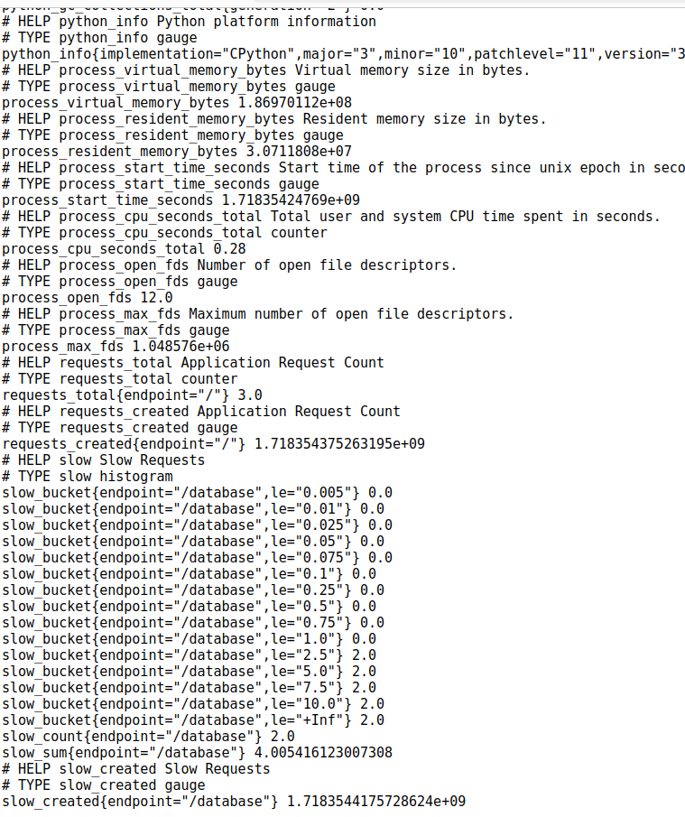

Learning generate_latest() of prometheus_client

To run the app:
$FLASK_APP=web.py flask run

More:
Requests counter counting the no. of requests and related metrics to the / endpoint
Histogram object for slow response endpoint (/database/)

